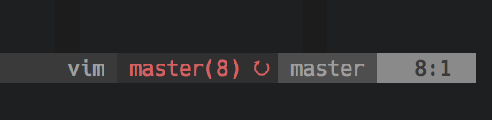

gitsync.nvim
===

**gitsync.nvim** is a [Neovim](https://github.com/neovim/neovim) plugin to stay up to date with your git repo, asynchronously.

**This plugin is alpha-quality.**

This plugin will only work for Neovim, since it wouldn't make sense to block vanilla vim's main thread to run a `git fetch`.

Installation
---

- [vim-plug](https://github.com/junegunn/vim-plug):

		Plug 'aykamko/gitsync.nvim'

Options
---
To enable [vim-airline](https://github.com/bling/vim-airline) integration, add the following line to your vimrc:

	let g:gitsync_airline = 1

If you don't use vim-airline and you'd still like a callback for when gitsync sees a change, you can use:

	let g:gitsync_statusline_callback = 'myCustomCallbackFunction'

TODO
---
- vim docs
- better README